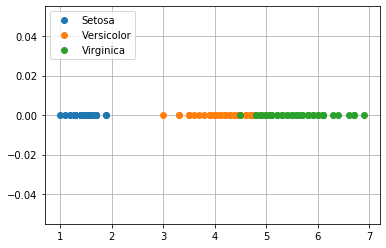
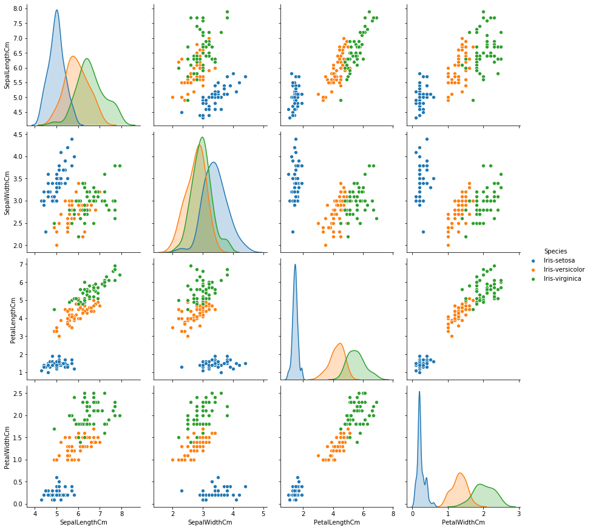
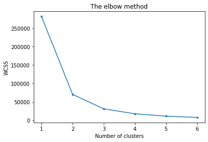
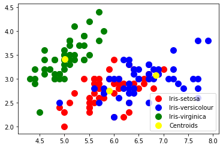

# K-Means Clustering 

K-means clustering is a type of unsupervised learning, which is used when you have unlabeled data (i.e., data without defined categories or groups). The goal of this algorithm is to find groups in the data, with the number of groups represented by the variable K. The algorithm works iteratively to assign each data point to one of K groups based on the features that are provided. Data points are clustered based on feature similarity.       
       
## Problem :
   
   From the given ‘Iris’ dataset, predict the optimum number of clusters and represent it visually.
   
## Dataset:
  
   Data can be found at :  https://drive.google.com/file/d/11Iq7YvbWZbt8VXjfm06brx66b10YiwK-/view
    
The dataset contains 150 rows and 6 columns the columns are SepalLenght,SepalWidth,PetalLenght,PetalWidth all the scales are in centemeter(cm) and the last row is Species which determine weather the flower is Setosa, Versicolor or Virginica.

Sepal length,Sepal width, Petal length, Petal width are called feature/Input-variable/Independent-variable
Species are called Labels/Dependent-variable/Output-variable/class-label/Response label

## Import necessary libraries
  
 import numpy as np
 import pandas as pd
 import matplotlib.pyplot as plt
 import seaborn as sns
 
## Visual Exploratory Data
 
  
As you can see after execution of the plot ,the data distribution among setosa, virginica, versicolor are equal so iris dataset is a Balanced dataset (as the number of data points for every class is 50).

  
  
## Preparing the data
 
 Drop the Species column from the data set to find the optimial value of K
 
## Note:

In cluster analysis, there usually is no training or test data split. Because you do cluster analysis when you do not have labels, so you cannot "train".Training is a concept from machine learning, and train-test splitting is used to avoid overfitting.But if you are not learning labels, you cannot overfit.

## Traning the Algorithm

I ll train the algorithm using K-Means method,then instaniate the cluster and fit it on the dataset using the fit() method
 
## Find the optimal value of K

Now we will implement 'The elbow method' on the Iris dataset. The elbow method allows us to pick the optimum amount of clusters for classification.
 
 
 
You can clearly see why it is called 'The elbow method' from the above graph, the optimum clusters is where the elbow occurs. This is when the within cluster sum of squares (WCSS) doesn't decrease significantly with every iteration. Now that we have the optimum amount of clusters, we can move on to applying K-means clustering to the Iris dataset.

### From this we choose the number of clusters as 3

## Visualising the clusters

  
## Conclusion
  We made the model that predicts species of iris flowers. Also we noticed that the "Iris-virginica" is separable and "Iris-setosa" and "Iris-versicolor" are not separable on K-Means algorithm.
